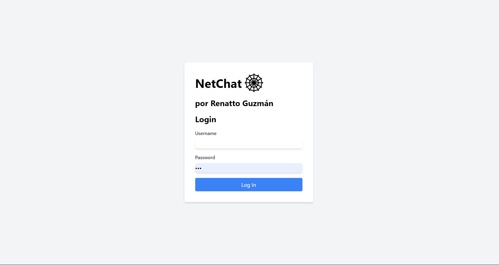
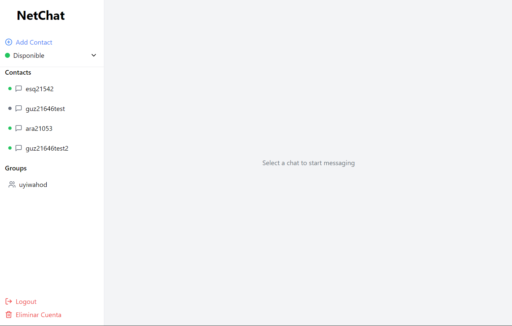
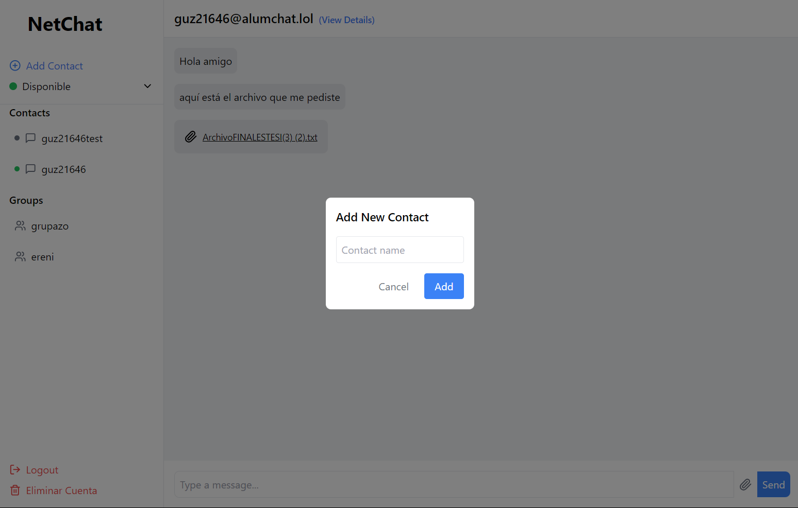

# 🎉 NetChat - A Real-time Chat Application

Welcome to **NetChat**, a modern real-time chat application built with React and Strophe.js! This application allows users to communicate through individual and group chats, send files, and manage contacts seamlessly. 

## 🚀 Features

- **Real-time Messaging**: Send and receive messages instantly.
- **Group Chat Support**: Create and manage group chats effortlessly.
- **File Sharing**: Upload and share files within chats.
- **Contact Management**: Add, view, and manage your contacts.
- **User Presence**: See the availability status of your contacts.
- **Notifications**: Receive notifications for messages and contact requests.

## 🛠️ Tech Stack

- **Frontend**: React.js
- **WebSocket Communication**: Strophe.js
- **Icons**: Lucide-react

## 📥 Getting Started

### Prerequisites

- Node.js
- npm

## 📦 Installation

1. Clone the repository:
  ```bash
  git clone https://github.com/RenattoGuzman/Proyecto1-Redes/
    
  cd Proyecto1-Redes
  ```
2. Install dependencies:

  ```bash
  npm install
  ```

3. Start the application:
```
npm run dev
```

Open your browser and navigate to http://localhost:5175.


## 📖 Usage

- Login with your credentials.

- Add Contacts by entering their usernames.

- Start Chatting by selecting a contact or a group from the sidebar.

- Send Files by using the file upload option in the chat area.

- Manage Your Account: Logout and delete your account.

## 🖼️ Screenshots

### - Login




### - Home



### - Sending Files and Notifications


### - Adding new contact


